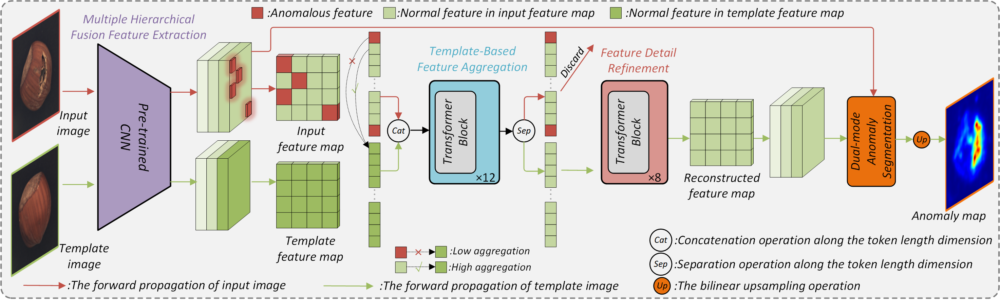

# [Template-based Feature Aggregation Network for industrial anomaly detection (EAAI 2024)](https://www.sciencedirect.com/science/article/abs/pii/S0952197623019942)
PyTorch implementation and for EAAI2024 paper, Template-based Feature Aggregation Network for industrial anomaly detection.  
  
# Download Datasets
Please download MVTecAD dataset from [MVTecAD dataset](https://www.mvtec.com/de/unternehmen/forschung/datasets/mvtec-ad/) and MVTecLOCOAD dataset from [MVTecLOCOAD](https://www.mvtec.com/company/research/datasets/mvtec-loco).
# Citation
If you find this repository useful, please consider citing our work:  
```
@article{luo2024template,
  title={Template-based Feature Aggregation Network for industrial anomaly detection},
  author={Luo, Wei and Yao, Haiming and Yu, Wenyong},
  journal={Engineering Applications of Artificial Intelligence},
  volume={131},
  pages={107810},
  year={2024},
  publisher={Elsevier}
}
```

